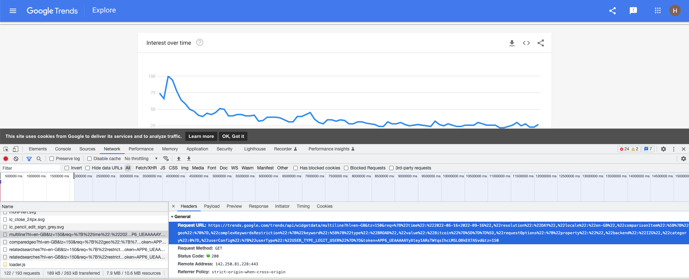

# Google Trends Project

---
Date: 2022-09-13

Author: Hongyuan Qiu

About: Coding and Data Collection Take-home Tech Assessment from EonLabs

---

## Idea Description
I'm using pytrends, an unofficial API, to collect the bitcoin daily trends data 
from Google Trends. After that, I got weekly trends data by processing daily 
trends data.

## Time Spent
I spent nearly 15 hours on this project. To be specific:
1. Start the program (1 hour)
   * Reading the Coding & Data Collection Take-home Tech Assessment (TTA)
   * Take a look at Google Trends
   * Think about the approaches I may try
2. Initiate the project (3 hours)
   * Create a GitHub repository for this project
   * Use Python virtual environment in Jupyter Notebook (it takes me a while...)
   * Try using some Python library in the Jupyter Notebook to test the virtual environment
   * Update README.md file
3. Try pytrends API in Jupyter Notebook (4 hours)
   * Reading the documentation of pytrends API
   * Try pytrends API in Jupyter Notebook
   * Collect bitcoin daily trends data
   * Process bitcoin daily trends data to obtain weekly data
   
   You can find related file in `collect_bitcoin_trends_data_jupyter` folder
4. Try another method (2 hours)
   * Try to get the data by sending request using the API URL found in the 
   network tab of Google Trends
   
   You can find related file in `collect_bitcoin_trends_data_jupyter` folder
5. Write and test the Python program (2 hours)
6. Write the README.md file, install and test the program in a new folder (3 hours)

## Methods
When I took a look at the Google Trends in the beginning, my first idea is to 
web-scraping the website to get the data. I changed my mind because I didn't find 
any options to select the right start time (2015-01-01 in this case) and the correct
resolution (daily) on the website. 

Then I thought about using some existing API to collect the data. So I found pytrends.
#### Collect the data using an unofficial API 
The first method I tried is using an unofficial API pytrends to collect the daily 
trends data from Google Trends. I tried to collect weekly data but it was not 
supported by pytrends. So I processed the daily data and got the weekly data 
using Pandas library. The weekly data is the mean value of the week.

The disadvantage of using this method is that it may be interrupted in the future 
if Google changes their backend, as it is addressed in the pytrends project description:
>Allows simple interface for automating downloading of reports from Google Trends. Only good until Google changes their backend again :-P. When that happens feel free to contribute!

At the same time, a warning message can be seen when using pytrends:
```commandline
/Users/hongyuan/personal_project/dev/google_trends/google_trends_venv/lib/python3.8/site-packages/pytrends/request.py:589: FutureWarning: The frame.append method is deprecated and will be removed from pandas in a future version. Use pandas.concat instead.
df = df.append(week_df)
```
It indicates that an older version of Pandas may be required in the future to 
solve the problem.

#### Collect the data by sending HTTP request with API URL
I feel that the first method may be less reliable. So I thought about sending HTTP 
request to the server to get the data myself. This method is similar to the first method. 
Except that I wanted to get the API URL for getting the data myself. I looked into 
the `Network` of the `Developer Tools` and found the API URL that Google Trends 
was using:



I found that there is a token inside the URL. I tried to get the data using this 
URL in the Jupyter Notebook and it worked. However, from my research and 
experiment, when I changed the parameters of the URL, I got 401 unauthorized error. 
It is possible that the token is only valid for the specific request (and maybe it will get expired). 
This method will not work until I can find the solution to the valid API URL.

## Final Method
My final Python program is using the pytrends API, the first approach. It is the 
method that got the work done. 

But I prefer using the second approach. If I am working in a team on this project, 
I will turn to my teammates for help. Hopefully I can get some hints for finding the valid URLs.    

## Installation (MacOS)
1. In the Terminal, go to a new empty folder, conduct git clone to get project 
repository from GitHub.
2. In the Terminal, create a virtual environment using Python 3.8: 
   ```
   python -m venv google_trends_venv
   ```   
3. Activate the virtual environment: 
   ```
   source google_trends_venv/bin/activate
   ```   
4. Install ipykernel which provides the IPython kernel for Jupyter: 
   ```
   pip install ipykernel
   ```
   Note: Skip steps 4-5 if you don't want to use Jupyter Notebook
   
5. Add the virtual environment to Jupyter:
   ```
   python -m ipykernel install --name=google_trends_venv
   ```
   This will print information similar to:
   ```
   Installed kernelspec google_trends_venv in /usr/local/share/jupyter/kernels/google_trends_venv
   ```
6. Go to `google_trends_project` folder and intall Python libraries/packages:
   ```
   pip install -r "requirements.txt"
   ```

## Uninstallation (MacOS)
#### Deactivate virtual environment
To deactivate the Python virtual environment, you can run in Terminal: 
```
deactivate
```
#### Remove kernel from Jupyter
You can list all the available kernels with:
```
jupyter kernelspec list
```
Uninstall the kernel `google_trends_venv`, you can type:
```
jupyter kernelspec uninstall google_trends_venv
```

## Execute program
In Terminal, go to folder `collect_bitcoin_trends_data_python_program` and run:
```
python collect_bitcoin_trends_data.py
```

## Reference:
1. [File .gitignore reference](https://github.com/github/gitignore/blob/main/Python.gitignore)
2. [Using Virtual Environments in Jupyter Notebook and Python](https://janakiev.com/blog/jupyter-virtual-envs/)
3. [How To Use Virtual Environment And Jupyter Notebook](https://pythoninoffice.com/virtual-environment-and-jupyter-notebook/)
4. [Remove pandas rows with duplicate indices](https://stackoverflow.com/questions/13035764/remove-pandas-rows-with-duplicate-indices)
5. [Access Google Trends Data without a wrapper, or with the API: Python](https://stackoverflow.com/questions/56340866/access-google-trends-data-without-a-wrapper-or-with-the-api-python)
6. [converting daily stock data to weekly-based via pandas in Python](https://stackoverflow.com/questions/34597926/converting-daily-stock-data-to-weekly-based-via-pandas-in-python)
7. [How to deal with SettingWithCopyWarning in Pandas](https://stackoverflow.com/questions/20625582/how-to-deal-with-settingwithcopywarning-in-pandas)
8. [Origin of tokens in Google trends API call](https://stackoverflow.com/questions/42317489/origin-of-tokens-in-google-trends-api-call)
9. [Why does Google Trends show different data for different time horizons?](https://qr.ae/pvUMig)
10. [Why is Google Trends data inconsistent when the time frame is slightly adjusted?](https://www.quora.com/Why-is-Google-Trends-data-inconsistent-when-the-time-frame-is-slightly-adjusted)
10. [FAQ about Google Trends data](https://support.google.com/trends/answer/4365533?visit_id=637989401016381261-1956494622&rd=1)
